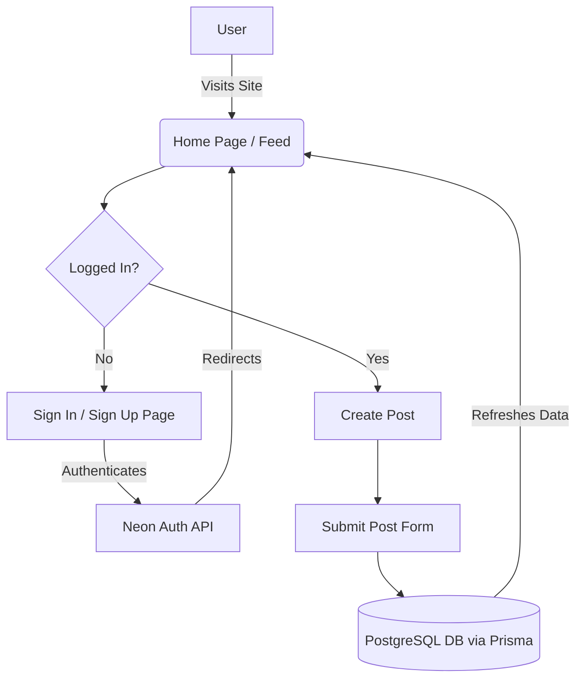

# Reddit Clone

This is a Next.js full-stack Reddit clone built as part of a tutorial.

## Features

- **User Authentication**: Handled via Neon Auth.
- **Create & Manage Posts**: Users can submit posts, view trending topics, and interact with the feed.
- **Database**: PostgreSQL (Neon) managed with Prisma ORM.
- **Modern UI**: Built with Tailwind CSS and shadcn/ui.

## Architecture Flowchart

The following flowchart illustrates the high-level user flow and data architecture:

## Getting Started

Follow these steps to set up the project locally.

### 1. Environment Variables
Rename `.env.example` to `.env` and fill in your connection strings and secrets:

- `DATABASE_URL`: Your Neon Postgres connection string.
- `NEON_AUTH_BASE_URL`: Your Neon Auth API base URL.
- `NEON_AUTH_COOKIE_SECRET`: A secure random string for signing cookies.

### 2. Install Dependencies
Install the required packages using pnpm:

\`\`\`bash
pnpm install
\`\`\`

### 3. Setup the Database
Push the Prisma schema to your Neon database and generate the Prisma client:

\`\`\`bash
pnpm run db:push
\`\`\`

### 4. Run the Development Server
Start the Next.js local server:

\`\`\`bash
pnpm dev
\`\`\`

Open [http://localhost:3000](http://localhost:3000) with your browser to see the application running.

## Usage Details

Once the application is running, you can explore the following flows:
1. **Browse Content**: The home page displays a feed of all posts. Unauthenticated users can view posts and trending topics.
2. **Authentication**: Click the "Sign Up" or "Log In" button in the navigation bar to create an account or authenticate via Neon Auth.
3. **Create Posts**: Once logged in, the "Create" button becomes available. You can submit new posts which are immediately saved to your Postgres database and displayed on the feed.

## License

This project is licensed under the MIT License.
